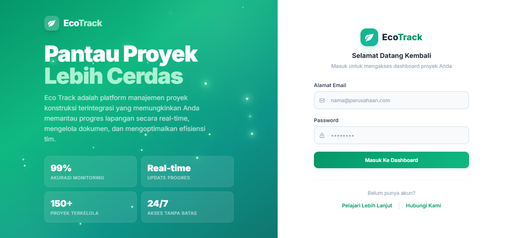
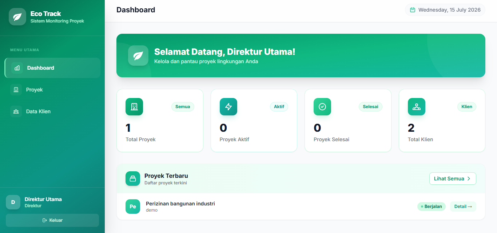

# 🌿 Eco Track

Eco Track adalah platform manajemen proyek konstruksi terintegrasi yang memungkinkan Anda memantau progres lapangan secara real-time, mengelola dokumen, dan mengoptimalkan efisiensi tim.

---

## 📸 Screenshot

**Login Page**



**Dashboard**



---

## ✨ Fitur

- Manajemen proyek & klien
- Catatan progres pekerjaan dengan timeline
- Upload & pengelolaan dokumen
- Dashboard statistik real-time
- 5 role pengguna (Admin, Direktur, Civil Engineer, Perizinan Lingkungan, Klien)
- Kategori proyek untuk visibilitas per role
- Pencarian data proyek & klien

---

## 🔐 Role & Akses

| Role | Proyek | Klien | Progres | Dokumen |
|------|--------|-------|---------|---------|
| Admin | CRUD | CRUD | - | - |
| Direktur | Lihat | Lihat | Lihat | Lihat |
| Civil Engineer | Lihat + Edit | Lihat | CRUD | Upload + Hapus |
| Perizinan Lingkungan | Lihat + Edit | Lihat | Tambah + Edit | Upload + Hapus |
| Klien | Lihat (milik sendiri) | Lihat (milik sendiri) | Lihat | Upload + Unduh |

---

## ⚙️ Tech Stack

- **Backend:** Laravel 13 (PHP 8.3+)
- **Frontend:** Tailwind CSS
- **Database:** MySQL

---

## 🚀 Instalasi

```bash
git clone https://github.com/NodeLabs13/ecotrack-tugasakhir.git
cd ecotrack-tugasakhir
composer install
npm install
cp .env.example .env
php artisan key:generate
php artisan migrate --seed
php artisan storage:link
npm run build
php artisan serve
```

Buka http://127.0.0.1:8000

---

## 👥 Akun Default

| Role | Email | Password |
|------|-------|----------|
| Admin | admin@ecotrack.test | password |
| Direktur | direktur@ecotrack.test | password |
| Civil Engineer | civil@ecotrack.test | password |
| Perizinan | perizinan@ecotrack.test | password |
| Klien | klien@ecotrack.test | password |
